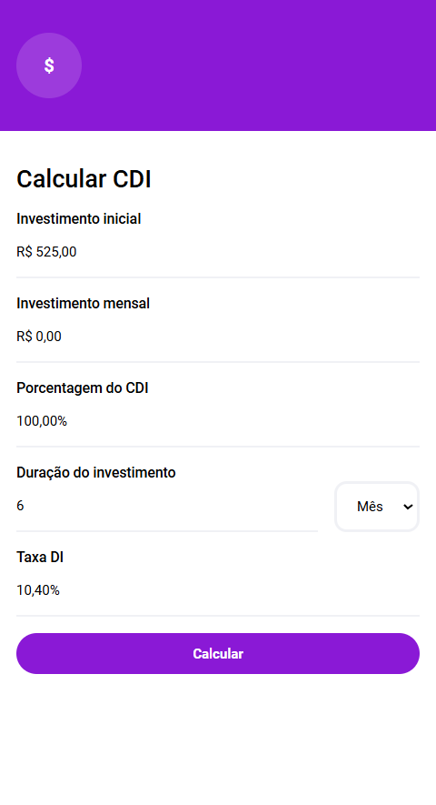
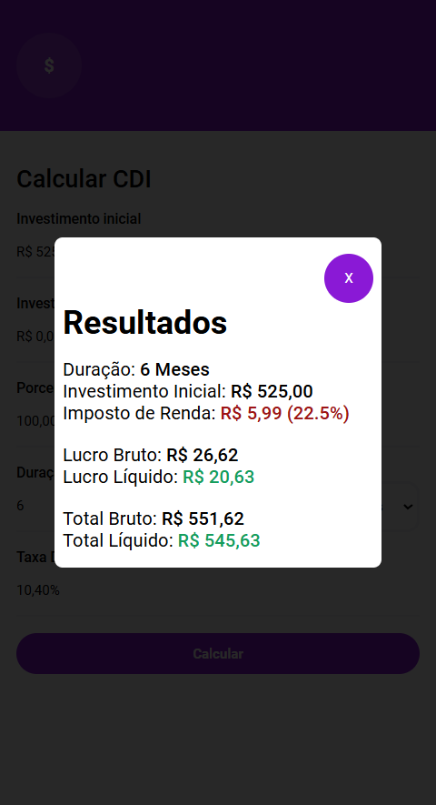

# Calculadora CDI

Este projeto consiste em uma calculadora financeira destinada a simular e calcular o retorno de investimentos baseados no Certificado de Depósito Interbancário (CDI). A ferramenta permite que o usuário insira informações como o valor investido, a taxa de rendimento (em % do CDI), e o período de aplicação. A calculadora fornecerá o retorno estimado do investimento, considerando a variação do CDI ao longo do tempo.

### Tecnologias usadas:
- Javascript
- HTML5
- CSS3

### Características:
- Layout responsivo
- Dark e Light mode

### Demonstrações:

